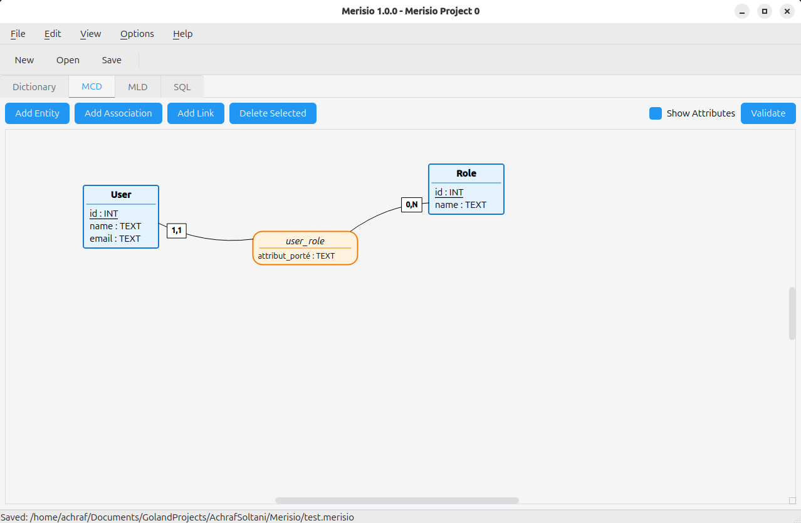

# Merisio

A modern **MERISE database modeling tool** built with Python and PySide6.

Create MCD (Conceptual Data Model) diagrams, automatically generate MLD (Logical Data Model) views, and export PostgreSQL SQL scripts.



---

## Download

<a href="https://github.com/AchrafSoltani/Merisio/releases/latest" class="btn">Download Latest Release</a>

### Available formats:
- **Linux**: `.tar.gz` (portable) or `.deb` (Debian/Ubuntu)
- **Windows**: `.zip` (portable)

---

## Features

### MCD Editor
- Visual diagram editor for entities, associations, and links
- Drag-and-drop positioning
- Multi-selection and deletion
- Cardinalities: (0,1), (0,N), (1,1), (1,N)
- Link styles: Curved, Orthogonal, Straight
- Toggle attribute visibility

### Data Dictionary
- Overview of all attributes across entities
- Define data types: INT, VARCHAR, TEXT, DATE, BOOLEAN, etc.

### MLD View
- Automatic Logical Data Model generation from MCD
- Editable column names (rename auto-generated foreign keys)
- Custom names saved in project

### SQL Generation
- PostgreSQL CREATE TABLE statements
- Automatic primary/foreign key generation
- Ready to execute scripts

### Project Management
- Save/load projects in `.merisio` JSON format
- Cross-platform compatibility

---

## Installation

### Linux (Debian/Ubuntu)

```bash
sudo dpkg -i merisio_1.1.0_amd64.deb
```

### Linux (Portable)

```bash
tar -xzvf Merisio-linux-x64.tar.gz
cd Merisio-linux-x64
./Merisio
```

### Windows

Extract `Merisio-windows-x64.zip` and run `Merisio.exe`

### From Source

```bash
git clone https://github.com/AchrafSoltani/Merisio.git
cd Merisio
python3 -m venv venv
source venv/bin/activate
pip install -r requirements.txt
python main.py
```

---

## Keyboard Shortcuts

| Shortcut | Action |
|----------|--------|
| Ctrl+N | New Project |
| Ctrl+O | Open Project |
| Ctrl+S | Save Project |
| Ctrl+1 | Dictionary Tab |
| Ctrl+2 | MCD Tab |
| Ctrl+3 | MLD Tab |
| Ctrl+4 | SQL Tab |
| Delete | Delete Selected |
| Ctrl+Scroll | Zoom In/Out |

---

## About MERISE

MERISE is a French methodology for database design, widely used in France and French-speaking countries. It uses:

- **MCD** (Modèle Conceptuel de Données) - Conceptual Data Model with entities and associations
- **MLD** (Modèle Logique de Données) - Logical Data Model with tables and relationships
- **MPD** (Modèle Physique de Données) - Physical Data Model (SQL implementation)

Merisio helps you design at the conceptual level and automatically generates the logical and physical models.

---

## License

GNU GPL v2

---

## Author

**Achraf SOLTANI**

- Email: [achraf.soltani@pm.me](mailto:achraf.soltani@pm.me)
- GitHub: [@AchrafSoltani](https://github.com/AchrafSoltani)

---

## Acknowledgments

Inspired by the original [AnalyseSI](https://launchpad.net/analysesi) Java project.
